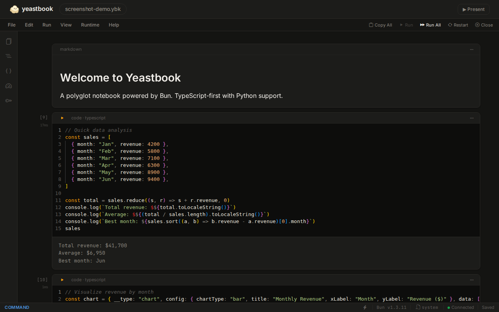
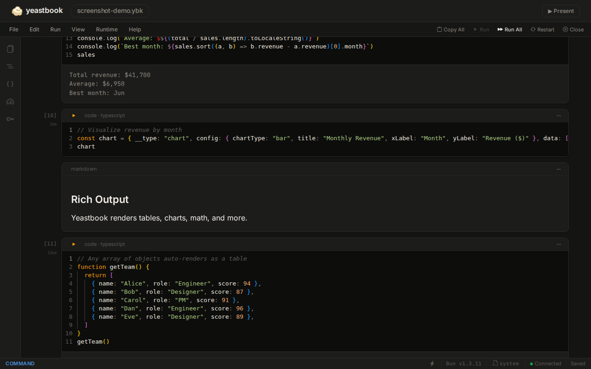
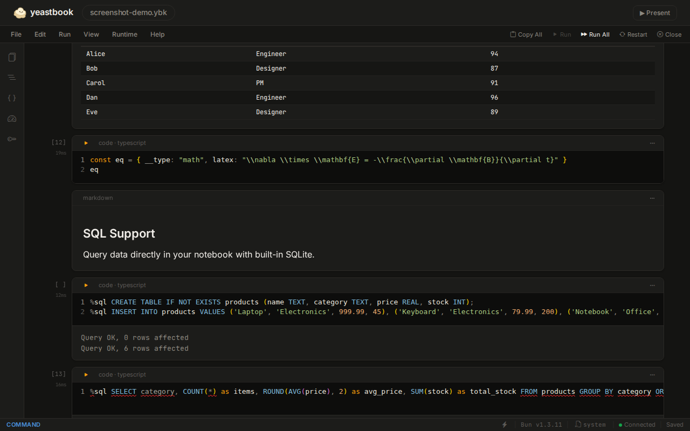

<p align="center">
  
</p>

<h1 align="center">Yeastbook</h1>

<p align="center">
  <strong>A polyglot notebook powered by Bun.</strong><br />
  TypeScript-first with Python support. One command, zero config.
</p>

<p align="center">
  <a href="https://github.com/codepawl/yeastbook/actions/workflows/ci.yml"></a>
  <a href="https://www.npmjs.com/package/@codepawl/yeastbook"></a>
  <a href="https://marketplace.visualstudio.com/items?itemName=codepawl.vscode-yeastbook"></a>
  <a href="https://opensource.org/licenses/MIT"></a>
</p>

<br />

<p align="center">
  
  <!-- TODO: Replace with actual screenshot of the notebook UI -->
</p>

---

## Quickstart

```bash
bunx @codepawl/yeastbook new
```

That's it. No Python, no conda, no kernel installs. Opens in your browser in under 1 second.

---

## Why Yeastbook?

| | Jupyter | Marimo | **Yeastbook** |
|---|---------|--------|---------------|
| Language | Python (+ kernels) | Python | **TypeScript + Python** |
| Runtime | IPython + ZeroMQ | Python | **Bun** (fast, single binary) |
| Setup | conda/pip + kernel install | pip install | **`bunx` or single binary** |
| Top-level await | No | No | **Yes** |
| Type checking | No | No | **Monaco + TypeScript** |
| Format | .ipynb (complex JSON) | .py | **.ybk** + .ipynb + .ybk.md |
| Package install | `%pip install` | `import` | **`%install lodash`** |
| Cross-language | Kernels (no shared state) | No | **YeastBridge** (shared data) |
| SQL | Needs extensions | No | **`%sql` built-in** |

---

## Features

<table>
<tr>
<td width="50%">

### Editor
- Full TypeScript with Monaco, IntelliSense, type checking
- Multi-cursor support (Alt+Click, Ctrl+D, cross-cell)
- Cell folding, find & replace across cells (Ctrl+Shift+H)
- Command palette (Ctrl+Shift+P)

### Execution
- Top-level `await` works out of the box
- Variables persist across cells
- Session snapshots survive server restarts (24h)
- Cell execution queue with cancel

</td>
<td width="50%">

### Output
- Charts (Chart.js), Vega/Vega-Lite visualizations
- Interactive DataFrame viewer with sort, filter, pagination
- JSON trees, data tables, HTML rendering
- LaTeX/KaTeX math rendering
- Matplotlib & PIL image display (Python cells)

### Ecosystem
- VS Code extension with full notebook support
- Jupyter import/export (.ipynb)
- Readable diff format (.ybk.md) for clean git diffs
- Plugin API for custom output renderers

</td>
</tr>
</table>

<p align="center">
  
  <!-- TODO: Replace with actual screenshot showing chart + table + JSON output -->
</p>

---

## Install

```bash
# Run instantly (no install needed)
bunx @codepawl/yeastbook new

# Or install globally
bun install -g @codepawl/yeastbook
yeastbook new

# Or download a binary (no Bun required)
curl -fsSL https://github.com/codepawl/yeastbook/releases/latest/download/install.sh | bash

# Or via Homebrew (macOS/Linux)
brew install codepawl/tap/yeastbook
```

### VS Code Extension

Search **"Yeastbook"** in VS Code Extensions, or install from the [Marketplace](https://marketplace.visualstudio.com/items?itemName=codepawl.vscode-yeastbook).

<p align="center">
  
  <!-- TODO: Replace with actual screenshot of VS Code with .ybk file open -->
</p>

### System Check

```bash
yeastbook doctor    # Verify Bun, Python, venv, ports
```

---

## Python Support

Toggle any code cell to Python with the language badge or press `L` in command mode.

```python
import numpy as np
data = np.random.randn(1000)
print(f"Mean: {data.mean():.4f}, Std: {data.std():.4f}")
```

**YeastBridge** — share data between TypeScript and Python:

```ts
// TypeScript cell
yb.push("config", { lr: 0.001, epochs: 10 })
```

```python
# Python cell
config = yb.get("config")
print(config["lr"])  # 0.001
```

Yeastbook auto-detects virtualenvs (`.venv/` or `venv/`) and injects them automatically.

---

## SQL Support

Query SQLite databases and CSV files directly in your notebook:

```
%sql import sales.csv as sales
%sql SELECT category, SUM(amount) as total FROM sales GROUP BY category ORDER BY total DESC
```

```
%sql attach analytics.db
%sql @analytics SELECT * FROM events WHERE date > '2024-01-01' LIMIT 100
```

Results render as interactive tables with sorting, filtering, and pagination.

<p align="center">
  
  <!-- TODO: Replace with actual screenshot of SQL query + table result -->
</p>

---

## Rich Output

```ts
// Chart.js
;({ __type: "chart", data: [10, 20, 30], config: { chartType: "bar", title: "Sales" } })

// Vega-Lite
;({ __type: "vega", spec: { $schema: "...", data: { values: [...] }, mark: "bar", encoding: {...} } })

// DataFrame
;({ __type: "dataframe", columns: ["name", "age"], data: [{name: "Alice", age: 30}], shape: [100, 2] })

// LaTeX
;({ __type: "math", latex: "E = mc^2" })

// HTML
;({ __type: "html", html: "<h1 style='color: tomato'>Hello</h1>" })

// Table (any array of objects auto-renders)
[{ name: "Alice", age: 30 }, { name: "Bob", age: 25 }]
```

---

## CLI Reference

```bash
yeastbook new                        # Create new .ybk notebook
yeastbook new --ipynb                # Create new .ipynb notebook
yeastbook new --template <name>      # Create from template
yeastbook <file.ybk>                 # Open existing notebook
yeastbook export <file.ybk>          # Convert .ybk -> .ipynb
yeastbook import <file.ipynb>        # Convert .ipynb -> .ybk
yeastbook export-md <file.ybk>       # Convert .ybk -> .ybk.md (readable diff)
yeastbook import-md <file.ybk.md>    # Convert .ybk.md -> .ybk
yeastbook export-script <file.ybk>   # Export to .ts script
yeastbook strip-outputs <file.ybk>   # Remove outputs for clean commits
yeastbook doctor                     # Check system requirements
```

---

## Keyboard Shortcuts

| Shortcut | Action |
|----------|--------|
| `Shift+Enter` | Run cell & advance |
| `Ctrl+Enter` | Run cell & stay |
| `Ctrl+S` | Save |
| `Ctrl+Shift+P` | Command palette |
| `Ctrl+Shift+E` | Toggle presentation mode |
| `Ctrl+Shift+H` | Find & replace across cells |
| `Ctrl+Shift+D` | Select across all cells |
| `A` / `B` | Add cell above / below (command mode) |
| `D D` | Delete cell (command mode) |
| `M` / `Y` | Switch to markdown / code |
| `L` | Toggle TypeScript / Python |

---

## Development

```bash
git clone https://github.com/codepawl/yeastbook
cd yeastbook
bun install
bun run dev          # Build UI + start dev server with hot reload
bun test             # Run tests (197 tests)
bun run build:all    # Full build (UI + embed + all platform binaries)
```

### Project Structure

```
packages/
  core/    @codepawl/yeastbook-core   — shared types, transforms, format conversion
  app/     @codepawl/yeastbook        — CLI, server, kernel, SQL engine
  ui/      @codepawl/yeastbook-ui     — React UI (Monaco editor, rich outputs)
  vscode/  vscode-yeastbook           — VS Code extension (notebook API)
```

### Publishing

Releases are automated via GitHub Actions on tag push (`v*.*.*`). Manual publish:

```bash
npm login
bun run publish:all
```

---

## Contributing

See [CONTRIBUTING.md](CONTRIBUTING.md). PRs welcome!

## License

[MIT](LICENSE) — Made by [CodePawl](https://github.com/codepawl)

Built with [Claude Code](https://claude.com/claude-code) as coding assistant.
